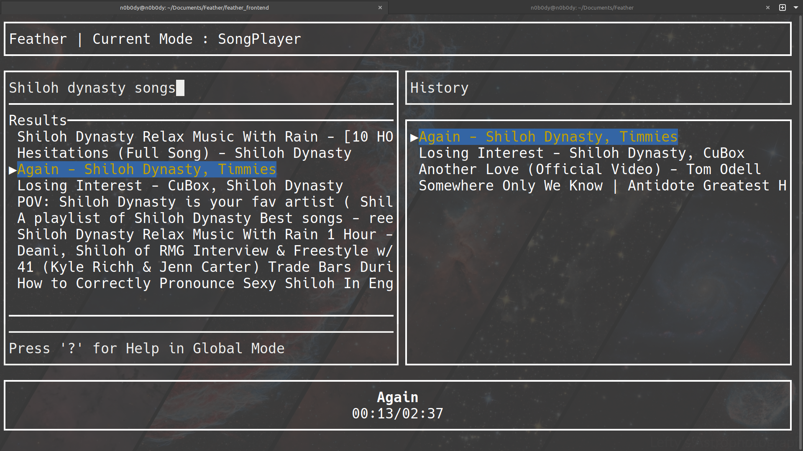

# Feather 🎵

Feather is a lightweight, efficient, and locally hosted YouTube Music TUI built with Rust. It is designed to provide a minimalistic yet powerful music streaming experience directly from YouTube, using `yt-dlp` and `mpv`.

## 🎯 Aim

A lightweight, ad-less player with only essential features.

## ✨ Features

- 🎶 **Stream YouTube Music** without downloading files.
- ⚡ **Minimal Memory Usage**, targeting **60MB - 80MB RAM**.
- 🚀 **Fast Playback**, with loading times around 3 seconds.
- 🖥️ **Terminal User Interface (TUI)** built using Ratatui.
- 🔄 **Self-Update Feature** (planned).

## 🛠️ Installation

### 📌 Prerequisites

Ensure you have the following installed:

- 🦀 **Rust** (latest stable version)
- 📥 **yt-dlp** (for fetching YouTube data)
- 🎵 **mpv** (for playback)

### 🔧 Build from Source

```sh
git clone https://github.com/13unk0wn/Feather.git
cd Feather/feather_frontend
cargo build --release
```

### ▶️ Run Feather

```sh
./target/release/feather_frontend
```

## 🎮 Usage

Navigate through the TUI to search and play music. Additional controls and keyboard shortcuts will be documented soon.

### 🛠️ Handling YouTube Restrictions

If a song fails to play due to YouTube restrictions, you can bypass them by adding your cookies to the environment:

```sh
export FEATHER_COOKIES="paste your cookies here"
```

- This is **optional** and should only be used if playback errors occur.
- Feather can play songs without cookies, but adding them may help `mpv` bypass certain restrictions.

## 🌄 Screenshot



## 🛠️ Compatibility

Feather has been tested on **Linux Mint (Debian Edition)**, but all libraries used are compatible with other Linux distributions.
Windows and Macos are not officially supported.

## 🛣️ Roadmap

### 🚀 Current Version: v0.1.0
- 🎶 Implement player
- 🔍 Implement search
- �햐 Implement history

### 🔥 Upcoming: v0.2.0
- ⚡ Improve performance
- 🎨 Improve UI
- 🌜 Add support for playing playlists
- 🎼 Add support for creating user playlists
- ⚙️ Add user configuration support

## 🤝 Contributing

Check out [CONTRIBUTION.md](https://github.com/13unk0wn/Feather/blob/main/CONTRIBUTING.md)

If you have any doubts regarding contribution, feel free to reach out via:
- GitHub Issues
- @x: [13unk0wn](https://x.com/13unk0wn)
- Email: [13unk0wn.proton.me](mailto:13unk0wn@proton.me)

## 🌟 Special Thanks

A big thank you to the maintainers and contributors of:
- [RustyPipe](https://codeberg.org/ThetaDev/rustypipe) — for providing essential tools for YouTube playback.
- [mpv](https://github.com/mpv-player/mpv) — for making a great media player that powers Feather's playback.
- [Ratatui](https://github.com/tui-rs-revival/ratatui) — for enabling the terminal-based UI experience.
- [Sled](https://github.com/spacejam/sled) - database

## 🌟 License

Feather is licensed under the MIT License.

---

### 📝 Notes

This project is still in early development. Expect rapid iterations and improvements. Suggestions and feedback are always appreciated!


